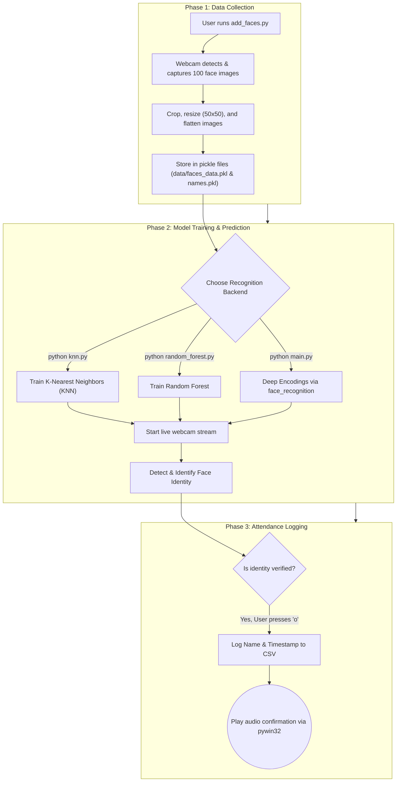

<div align="center">
  <h1>📸 Face Recognition Attendance System</h1>
  <p>An automated and highly accurate attendance tracker powered by OpenCV, Scikit-Learn, and Python.</p>

  
  
  
  
</div>

---

## 📖 Overview
The **Face Recognition Attendance System** provides an efficient, touchless, and automated way to track attendance using computer vision. The system captures faces through a webcam, extracts features, and recognizes them against trained biometric data to mark attendance with exact timestamps. It's built with flexibility in mind, offering multiple backend algorithms to choose from: **K-Nearest Neighbors (KNN)**, **Random Forest**, and Deep Learning models.

## ✨ Key Features
- **Real-Time Detection:** Rapid facial detection using Haar Cascade classifiers.
- **Multiple AI Models:** Dynamically switch between KNN, Random Forest, or `face_recognition` backends for optimum accuracy.
- **Automated CSV Logging:** Generates daily `.csv` attendance reports automatically.
- **Voice Feedback:** Text-to-Speech (TTS) auditory confirmation using Windows `pywin32` when attendance is taken.
- **Cross-Domain Application:** Perfect for classrooms, corporate offices, events, and restricted zones.

## 🛠 Tech Stack
- **Core Language:** Python 3
- **Computer Vision:** `opencv-python`
- **Machine Learning:** `scikit-learn` (KNN, Random Forest models)
- **Deep Learning (Optional):** `face_recognition`, `dlib`
- **Utility & Data:** `NumPy`, `Pickle`, `CSV`
- **Audio Feedback:** `win32com` (Windows)

---

## ⚙️ System Workflow Explained



## 📁 Project Structure
```text
📦 Face-Recognition-Attendance-system
 ┣ 📂 data                       # Contains pickled data and Haar Cascades
 ┃ ┣ 📜 haarcascade_frontalface_default.xml
 ┃ ┣ 📜 names.pkl                # User names memory
 ┃ ┗ 📜 faces_data.pkl           # Numpy array of captured faces
 ┣ 📂 Attendance                 # Automatically created folder for CSVs
 ┃ ┗ 📜 Attendance_DD-MM-YYYY.csv
 ┣ 📜 add_faces.py               # Script to register new faces
 ┣ 📜 knn.py                     # K-Nearest Neighbor main script
 ┣ 📜 random_forest.py           # Random Forest main script
 ┣ 📜 main.py                    # Deep learning main script (requires dlib)
 ┣ 📜 requirements.txt           # Python library dependencies
 ┗ 📜 README.md                  # Project documentation
```

---

## 🚀 Installation & Setup

1. **Clone the Repository:**
   ```bash
   git clone <your-repository-url>
   cd Face-Recognition-Attendance-system
   ```

2. **Create a Virtual Environment (Recommended):**
   ```bash
   python -m venv venv
   # Windows:
   .\venv\Scripts\activate
   # macOS/Linux:
   source venv/bin/activate
   ```

3. **Install Dependencies:**
   ```bash
   pip install -r requirements.txt
   pip install scikit-learn pywin32
   ```
   > **Note:** If you intend to use `main.py` which depends on `face_recognition` and `dlib`, you must have CMake and standard C++ build tools installed on your operating system. Otherwise, `knn.py` and `random_forest.py` will work perfectly without them!

4. **Ensure Haar Cascades Exist:**
   Make sure you have a `data` folder at the root of the project containing the `haarcascade_frontalface_default.xml` file.

---

## 🎮 How to Use

### 1. Register a Person
To add a new authorized person to the attendance system, run:
```bash
python add_faces.py
```
- The terminal will prompt you to enter the person's name.
- Look into your webcam. The application will instantly capture exactly 100 frames and exit. (Press `q` anytime to abort).

### 2. Run the Attendance System
Now that the data is collected, start the tracking server using your preferred model. 
```bash
# Recommended for standard setups without dlib:
python knn.py

# Alternatively:
python random_forest.py
python main.py
```

### 3. Mark Attendance
- A live webcam window will launch, drawing boxes around detected faces and predicting the user's name.
- While your face is being identified, **press the `o` key** to log your attendance into the database. You will hear an audio confirmation immediately.
- To exit the program, press `q`.

---

<div align="center">
  <i>Developed with ❤️ using Python and Computer Vision</i>
</div>
